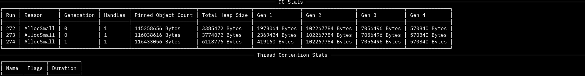

# Perfy: Dotnet Performance Monitor

This is based on the amazing [realmon](https://github.com/Maoni0/realmon)

## Installation

Global

```
dotnet tool install --global perfy-cli --version 1.0.0
```

local

```
dotnet new tool-manifest # if you are setting up this repo
dotnet tool install --local perfy-cli --version 1.0.0
```

## Examples

```sh
perfy-cli -p 12345 -t 30
```

```sh
pefy-cli -n procName -t 30
```


